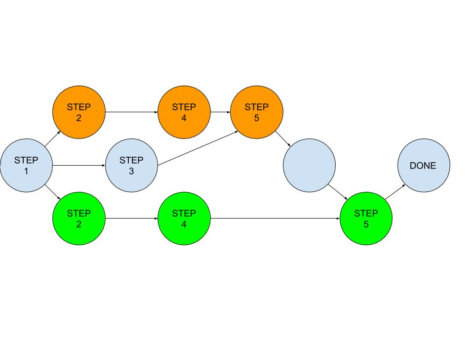

# Lab - Version Control

This is a partner lab. There is a lot of reading to describe Git; the [exercise](#exercise) is below. You will need to work with a partner to complete the simple Git exercise. Groups of three are allowed, but discouraged unless one of you has familiarity with Git because it will make everything more complicated. 

## Version Control Systems 

Version control systems (VCSs) are tools used to track changes to source code
(or other collections of files and directories/folders). As the name implies, these tools
help maintain and control a history of changes/versions. Furthermore, they facilitate collaboration among developers who work on the same project.
VCSs track changes to a folder and its contents in a series of snapshots, where
each snapshot encapsulates the entire state of files/folders within a top-level
directory. VCSs also maintain metadata, such as who created each snapshot, messages
associated with each snapshot, and so on.

Why is version control useful? Even when you're working by yourself, it can let
you look at or even roll back to old snapshots of a project, keep a log of why certain changes were
made, work on parallel branches of development, and much more. When working
with others, it's an invaluable tool for seeing what other people have changed,
as well as resolving conflicts in concurrent development.

Modern VCSs also let you easily (and often automatically) answer questions
like:

- Who wrote this module?
- When was this particular line of this particular file edited? By whom? Why
  was it edited?
- Over the last 10 revisions, when/why did a particular unit test stop
working?

While other VCSs exist, **Git** is the de facto standard for version control. Keep in mind that Git is not Github. Github is a browser-based service that allows us to host Git repositories (most often, coding projects) remotely on the Internet. There are others, such as Gitlab or Bitbucket.

We already have some exposure to Git through this class, as you create your own private repositories from our template repositories that contain starter code. This is what you **clone**. As you fill in the files we have given you and add new files and directories yourselves, you can **commit** these changes locally. Eventually, you **push** them to a remote repository and this is when you can see them on online on Github.

While working on our project, we may find the need to work on multiple features or work on a bug in isolation of our main code. Our main line of work is committed in what is known as the `main` **branch** (note: In 2020, Github stopped calling the primary branch as master and calls it main). As need arises, we can create different branches (which we name something informative, e.g., the feature name we are developing) and work on them in parallel. At some point, we might **merge** branches together.

Starting with HW3, Darwin, you and your classmate(s) will collaborate on the same project. This is even more relevant in the real world. You would each work locally on your individual machine and you would need to occasionally **sync up** the remote repository by **pull**ing any changes that others have made to your local repository. As you can imagine, if two users work on the same lines of the same file, conflicts might arise that need to be resolved before we can **merge** the two versions. You can also **rebase**  which means that you adjust your working copy to be based on a new starting point.

Git is an essential tool for every modern programmer. Most programmers do not use GUI-based tools such as the extension we use on VS Code. Instead, they work through the terminal by using a number of shell commands. 
This [XKCD comic](https://xkcd.com/1597/) captures Git's reputation (and the fact that things can often go wrong if we don't understand how Git works):


Because Git's interface is a leaky abstraction (i.e. an abstraction that exposes details and limitations of its underlying implementation to its users that should ideally be hidden away), learning Git top-down (starting
with its interface and memorizing commands) can lead to a lot of confusion.
It is possible to memorize a handful of commands, think of them as magic
incantations, and follow the approach in the comic above whenever anything goes
wrong.

While Git admittedly has an ugly interface, its underlying design and ideas are
beautiful. While an ugly interface has to be _memorized_, a beautiful design
can be _understood_. For this reason, we give a bottom-up explanation of Git,
starting with its data model and later covering the command-line interface.
Once the data model is understood, the commands can be better understood in
terms of how they manipulate the underlying data model (see Appendix A).


## Git command-line interface basics

The `git init` command initializes a new local Git repository, with repository
metadata being stored in the `.git` hidden directory. Note that your computer may need to locally install a copy of `git` if typing `git` into the terminal results in command not found. Note that the following terminal output is for Mac/Linux; the `git` commands will be the same for Windows, but the directory structure might be different.

```console
apaa2017@APAA2017-MAC21 ~ %  mkdir myproject
apaa2017@APAA2017-MAC21 ~ %  cd myproject
apaa2017@APAA2017-MAC21 myproject %  git init
Initialized empty Git repository in /Users/apaa2017/myproject/.git/
apaa2017@APAA2017-MAC21 myproject %  git status
On branch main

No commits yet

nothing to commit (create/copy files and use "git add" to track)
```

How do we interpret this output? "No commits yet" basically means our version
history is empty. Let's fix that by creating a file with some contents, adding to the staging area and committing it:

Note that the `echo "something" > file.txt` command saves "something" into file.txt.

```console
apaa2017@APAA2017-MAC21 myproject % echo "hello, git" > hello.txt
apaa2017@APAA2017-MAC21 myproject % git add hello.txt
apaa2017@APAA2017-MAC21 myproject % git status
On branch main

No commits yet

Changes to be committed:
  (use "git rm --cached <file>..." to unstage)

        new file:   hello.txt

apaa2017@APAA2017-MAC21 myproject % git commit -m 'Initial commit'
[main (root-commit) 4515d17] Initial commit
 1 file changed, 1 insertion(+)
 create mode 100644 hello.txt
```

With this, we've `git add`ed a file to the staging area, and then `git commit`ed that change, adding a simple commit message "Initial commit". If we
didn't specify a `-m` option, Git would open our text editor to allow us to type a
commit message.

Let's make some more changes, author a new commit:

```console
apaa2017@APAA2017-MAC21 myproject % echo "another line" >> hello.txt
apaa2017@APAA2017-MAC21 myproject % git status
On branch main
Changes not staged for commit:
  (use "git add <file>..." to update what will be committed)
  (use "git checkout -- <file>..." to discard changes in working directory)

        modified:   hello.txt

no changes added to commit (use "git add" and/or "git commit -a")
apaa2017@APAA2017-MAC21 myproject % git add hello.txt
apaa2017@APAA2017-MAC21 myproject % git status
On branch main
Changes to be committed:
  (use "git reset HEAD <file>..." to unstage)

        modified:   hello.txt

apaa2017@APAA2017-MAC21 myproject % git commit -m 'Add a line'
[main 35f60a8] Add a line
 1 file changed, 1 insertion(+)
```

Now that we have a non-empty version history, we can visualize the history.
Visualizing the history as a DAG can be especially helpful in understanding the
current status of the repo and connecting it with your understanding of the Git
data model. The `git log` command visualizes history. By default, it shows a flattened
version, which hides the graph structure. If you use a command like `git log --all --graph --decorate`, it will show you the full version history of the
repository, visualized in graph form.

```
apaa2017@APAA2017-MAC21 myproject % git log --all --graph --decorate

* commit 35f60a825be0106036dd2fbc7657598eb7b04c67 (HEAD -> main)
| Author: apaa2017 <apaa2017@pomona.edu>
| Date:   Wed Nov 1 22:03:17 2023 -0700
| 
|     add a line
| 
* commit 4515d17a167bdef0a91ee7d50d75b12c9c2652aa
| Author: apaa2017 <apaa2017@pomona.edu>
  Date:   Wed Nov 1 22:00:21 2023 -0700
      Initial commit
```

Note that it shows the current `HEAD`, along with the current branch
(`main`).

We can look at old snapshots using the `git checkout` command and passing it the commit hash (yours will be different). When satisfied, you can skip back to the current state.

```console
apaa2017@APAA2017-MAC21 myproject % git checkout 4515d17
Note: checking out '4515d17'.

You are in 'detached HEAD' state. You can look around, make experimental
changes and commit them, and you can discard any commits you make in this
state without impacting any branches by performing another checkout.

If you want to create a new branch to retain commits you create, you may
do so (now or later) by using -b with the checkout command again. Example:

  git checkout -b <new-branch-name>

HEAD is now at 4515d17 Initial commit
apaa2017@APAA2017-MAC21 myproject % cat hello.txt
hello, git
apaa2017@APAA2017-MAC21 myproject % git checkout main
Previous HEAD position was 4515d17 Initial commit
Switched to branch 'main'
apaa2017@APAA2017-MAC21 myproject %  cat hello.txt
hello, git
another line
```

Basic shell git commands to know:
- `git help <command>`: get help for a git command
- `git init`: creates a new git repo, with data stored in the `.git` directory
- `git status`: tells you what's going on
- `git add <filename|directory>`: adds specified file or directory to staging area
    - e.g.,  `git add .`: adds the current working directory to the staging area
- `git commit -m <message>`: creates a new commit with the given message (make it good!)
- `git log`: shows a flattened log of history
- `git log --all --graph --decorate`: visualizes history as a DAG
- `git diff <filename>`: show changes you made relative to the staging area
- `git diff <revision> <filename>`: shows differences in a file between snapshots
- `git checkout <revision>`: updates `HEAD` to the specified snapshot

## Branching and merging

Branching allows you to "fork" version history. As we discussed, branching can be helpful for working
on independent features or bug fixes in parallel. The `git branch` command can
be used to create new branches; `git checkout -b <branch name>` creates a
branch and checks it out. Checking out a branch updates the files in the working directory to match the version stored in that branch, and it tells Git to record all new commits on that branch. Think of it as a way to select which line of development you’re working on.

Merging is the opposite of branching: it allows you to combine forked version
histories, e.g., merging a feature branch back into master. The `git merge`
command is used for merging.

Some handy commands for branching and merging:
- `git branch`: shows all local branches
- `git branch <name>`: creates a branch with the specified name
- `git checkout -b <name>`: creates a branch and switches to it
    - same as `git branch <name>; git checkout <name>`
- `git merge <revision>`: merges revision into current branch

## Remotes

Multiple people can work on a git repository. Each person gets their own copy of the whole repository. It is set up usually like this: there is one central repository which everyone who wants to work on it clones it. For each person, the original repository from where they made the copy is a remote repo.

The process of getting updates/changes from remote is called **pull**. When pulling, the latest commits from the remote repository are downloaded to the user's computer and applied to the working branch. It’s a common practice to pull periodically to stay up to date with what everyone else is doing with the repository.

Here are some handy commands when working with remote repositories:
- `git remote`: list remotes that the repository is configured to use
- `git remote add <name> <url>`: add a remote repository with the specified name to the specified url
- `git push -u <remote> <local branch>:<remote branch>`: send objects to remote, and update remote reference
- `git pull`: retrieve and apply objects/references from a remote
- `git clone`: download repository from remote

## Further resources

- [Pro Git](https://git-scm.com/book/en/v2) is **highly recommended reading**.
Going through Chapters 1--5 should teach you most of what you need to use Git
proficiently, now that you understand the data model. The later chapters have
some interesting, advanced material.
- [Oh Shit, Git!?!](https://ohshitgit.com/) is a short guide on how to recover
from some common Git mistakes.
- [Git from the Bottom Up](https://jwiegley.github.io/git-from-the-bottom-up/)
is a detailed explanation of Git's implementation details beyond just the data
model, for the curious.
- [Learn Git Branching](https://learngitbranching.js.org/) is a browser-based
game that teaches you Git.

## Prof. Li's Git cheatsheet
Before you want to commit and push something...

1. `git status` in the terminal to always check the status of your working directory, what has/hasn't been added to git
2. `git add [file/folder]` to add files/folders that are untracked
3. `git commit -am "commit message"` to commit both the files you just added and files you've changed
4. `git checkout [branch]` to switch branches (`checkout -b [branch]` if you're making a branch for the first time)
5. `git push origin [branch]` to push to a specific branch; if you're pushing to main, just `git push` is fine
6. `git pull origin [branch]` to pull from a specific branch; if you're pulling from main, just `git pull` is fine 
7. Before you pull for the first time, Git will ask you if you want to do the rebase method or the merge method to deal with combining commit history. Rebasing often results in fewer errors!

# Exercise

In this lab we will work in groups of two students:

1. Person 1 will log into Github.com and create a new public repository, clone that repo on their local machine, and create some content, commit it, and push it to the remote repository.
2. Person 2 will *clone* the remote repository. Both person 1 and person 2 will then create new personal branches with their first names.
3. Person 1 will make a change on the *main* branch and then checkout back to their personal branch.
4. Both person 1 and person 2 will create some new files in their personal branches and make changes to one of the original files.
5. Each team member will merge their personal branches back into the main branch and resolve any conflicts.

These steps are visualized in the following figure: 


### Following Instructions Carefully

1. You should be able to create and merge
   conflicting updates. Make sure that all commit messages include:
   * the step you are working on (i.e. Step 3, Step 4, Step 5)
   * who made the commit, of what updates, in what branch.

2. If you make the Step 3 changes before cloning your repos and creating your branches, you will not have a conflicting update in the main branch, and you will be unable to learn from resolving that conflict.

3. The two team-mates should take turns doing their Step 5 merges of Step 4 updates back into the *main* branch. If you attempt to do them in parallel, you will have to go through more pull/merge/push cycles.

Note that we are not using the VSCode Github extension for this assignment. It should be done in the terminal/shell, which means you might need to [install Git](https://git-scm.com/book/en/v2/Getting-Started-Installing-Git) if you don't have it already.

### Step 1 - Repo creation

One team member should:

* log into *github.com*
* create a new repo:
   * click `Repositories` on the top menu bar
   * click the green `New` button
   * enter a name and description
   * check the `public` and `Add a README file` options
   * click the green `Create repository` button
   * copy the returned URL (green Code tab) and send it to your team mate
   * click `Settings` go to `Collaborators` and under `Manage access`, click `Add people` and add the github username of your teammate.
* create a local clone (on a personal or lab machine)
   * start a Terminal window
   * `cd` to a directory where you want to do your work (e.g., your cs62 workspace).
   * make a local clone of the new repo, using the URL you copied, with a command like
     (obviously substituting in your github ID and repo name)
     ```
     git clone https://github.com/creators_github_id/your_new_repo.git
     cd your_new_repo
     ```
* create initial contents (in the cloned repo copy)
   * edit the auto-generated `README.md` to identify  which lab this is and the names of your team members
   * create new files `file1.txt` and `file2.txt` in your repo directory with contents like:
     ```
     Step 1:  created by YOUR_NAME on DATE at TIME
     ```
   * stage your changes
     ```
     git add .
     ```
    
   * look at what you have done
     ```
     git status
     ```

  * commit your changes
    ```
    git commit -m "Step 1, NAME, DATE and TIME"
    ```
   * push these changes back to the *main* branch on *github*
     ```
     git push
     ```
   At this point, if you go back to *github* and look at your repo,
   you should see these changes.

### Step 2 - Create personal branches

We will call these branches *person1* and *person2* (and possibly *person3*).  You should use your
own personal branch names.

* For the person who already has a cloned copy of the repo:
  ```
  git checkout -b person1
  ```
* For all other people who have not yet cloned their own copy
  ```
  git clone https://github.com/creators_github_id/your_new_repo.git
  cd your_new_repo
  git checkout -b person2
  ```

### Step 3 - Create conflicts by moving *main* beyond the new branches

After all personal branches have been created

* one team member, say person1, goes back to the *main* branch
  ```
  git checkout main
  ```
* adds a new line to file1.txt ... with contents like
     ```
     Step 3:  added by NAME on DATE at TIME
     ```
   * commit your changes
     ```
     git add file1.txt
     git commit -m "Step 3, NAME, DATE, and TIME"
     ```
   * push these changes back to github -- if the git push doesn't work, you need to add your partner as a collaborator in settings->manage access
     ```
     git push
     ```
* return to your personal branch
  ```
  git checkout person1
  ```

At this point, both of the new personal branches are behind (i.e., are not up to date with) main ...
giving rise to conflicts that will have to be reconciled in Step 5.

### Step 4 - People do work in their own branches

Each person, working on their own computer, _in their own branch_ should:

* create a new file (e.g. *person1.txt*) containing a line like:
  ```
  Step 4:  person1.txt created by NAME on DATE at TIME
  ```
* add a new line to the pre-existing *file1.txt*, like
  ```
  Step 4:  line added by NAME on DATE at TIME
  ```
* commit your changes
  ```
  git add .
  git commit -m "Step 4, NAME, DATE and TIME"
  ```
* review the git log to confirm that all of these changes have in fact
been made
  ```
  git log
  ```

Note that because your personal branches were created on your
personal machines, they do not (yet) exist on *github*, and so
you will not be able to `push` them back to *github*.

### Step 5 - Merge the (now conflicted) branches back into *main*

This is (at a minimum) a two step process:

1. update personal branch to be based on the latest updates in *main* (which
   has been updated since this branch was created).
2. update *main* to include the (now consistent) updates from your branch.

*Take turns doing step 5.*  Wait for one person to finish before the next person starts.  
Each person, working on their own machine, will, _in their own branch_:

* update their copy of the main branch (which they are not currently on)
  ```
  git config pull.rebase false
  git pull origin main
  ```
  Because your branch is based on *main*, git will automatically check
  to see if *main* now contains updates that your branch does not ... which it does.
  Worse, *main* contains an update to a file (file1.txt) that you have
  also changed, so git will insist that you must fix this conflict manually.

* merge your updates to file1.txt with those in the *main* branch
  * edit the conflicted file1.txt and correctly organize the lines
    (from different versions) in chronological order
    (and deleting the notations about which text came from which version)
  * tell Git you have resolved the conflict by re-adding the corrected version
     and committing (all of) the merge.
    ```
    git add file1.txt
    git commit -m "Step 5, NAME, DATE, and TIME" -a
    ```
    The `commit -a` tells git that you want to commit *all* of the changes
    associated with this merge.

  The first person to do this will only have to merge their changes against the line
  added to file1.txt in Step 3.  The second person to do this will also have to merge
  with the changes made by the first person in Step 5.

* now that your branch is up-to-date with *main*, merge *your changes* back into the *main* branch
  (note: The command `git merge person1` when executed in *main* will update
  *main* to include changes made to branch *person1*).

  ```
  git checkout main
  git merge person1
  ```
  This time, because your (*person1*) branch is now up-to-date with respect
  to *main*, git should be able to automatically perform a fast-forward merge.
  If so, all you have to do is a *commit* and *push*.  But if there are other
  changes to be reconciled, you may have to resolve them as you did above.

* if you did not do *all* of these steps *in the correct order* you may find
  yourself instructed to do additional *pull* and *merge* operations.  If
  this happens, do the *pulls* to update your local copies from recent
  pushes to *github* and additional *merges*.

* confirm that all of your work has now been checked in, and that you are fully up-to-date,
  and then push these updates back to *github*.
  ```
  git status
  git log
  git push
  ```

  The *status* command should show that you are up-to-date with respect to
  *main*, and that you have no uncommitted changes.

  The *log* command should show (in reverse chronological order):
  - the Step 5 merge from person2
  - the Step 5 merge from person1
  - the Step 4 changes from person2
  - the Step 4 changes from person1
  - the Step 3 change to main
  - the original Step 1 creation and contents additions

  If the person who created the repo on *github* does not correctly authorize
  pushes from un-registered collaborators, the other team-mate may find their
  pushes rejected.  The easiest way around this problem is, when prompted for
  a git-ID and password, have the person who created the repo enter their ID
  and password.

### Git configuration

If you have not used the Git Command-Line-Interfaces before, it would be
helpful to do a little bit of initial setup.
From a terminal window 
type the following commands:
   ```
   git config --global user.name "Your Name"
   git config --global user.email your_email@your_domain
   ```

When you do `git commit` command (without a **-m** argument), you will be put
into a text editor (the default editor is *vim*) to see the files being committed and edit your comment.
If you have a preferred editor, you can set it with a command like:
   ```
   git config --global core.edior emacs
   ```
If you are not comfortable with any of the available editors, you
should always use the **-m** "*comment*" to create your commit
comments.

## Checking off
Once you have finished all 5 steps, submit your repo on Gradescope and find a TA/instructor to get checked off. We will be looking at your Github commit history to make sure it matches the log above; this is why we need a public repo. If you mess up, no worries: you can delete the old repo and start anew with a fresh one. Please also fill out this week's [exit ticket](https://forms.gle/fp28fGUnzPEj8WSV9).


## Acknowledgments

This lab has been adapted from the missing semester course offered at MIT. Certain material has been adapted from Wikipedia, former class material, other online resources.

# Appendix A: 

## Git's data model

There are many ad-hoc approaches you could take to version control. Git has a
well-thought-out model that enables all the nice features of version control,
like maintaining history, supporting branches, and enabling collaboration.

### Snapshots

Git models the history of a collection of files and folders within some
top-level directory as a series of **snapshots**. In Git terminology, a file is
called a **blob**, and it's just a bunch of bytes. A directory is called a
**tree**, and it maps names to blobs or trees (i.e. filenames and directory names, respectively). 
Consequently, directories can contain other
directories. A snapshot is the top-level tree that is being tracked. For
example, we might have a tree as follows:

```
<root> (tree)
|
+- foo (tree)
|  |
|  + bar.txt (blob, contents = "hello world")
|
+- baz.txt (blob, contents = "git is wonderful")
```

Here, the top-level tree (directory root) contains two elements, a tree (directory) "foo" (that itself contains
one element, a blob/file "bar.txt" with contents "hello world"), and a blob (file) "baz.txt" with contents "git is wonderful".

### Modeling history: relating snapshots

How should a version control system relate snapshots? One simple model would be
to have a linear history. A history would be a list of snapshots in time-order.
For many reasons, Git doesn't use a simple model like this.

In Git, a history is a directed acyclic graph (DAG) of snapshots. That may
sound like a fancy math word, but don't be intimidated. All this means is that
each snapshot in Git refers to a set of "parents", the snapshots that preceded
it. It's a set of parents rather than a single parent (as would be the case in
a linear history) because a snapshot might descend from multiple parents, for
example, due to combining (merging) two parallel branches of development.


Git calls these snapshots **commit**s. Visualizing a commit history might look
something like this:

```
o <-- o <-- o <-- o
            ^
             \
              --- o <-- o
```

In the ASCII art above, the `o`s correspond to individual commits (snapshots).
The arrows point to the parent of each commit (it's a "comes before" relation,
not "comes after" since we don't know the future). After the third commit, the history branches into two
separate branches. This might correspond to, for example, two separate features
being developed in parallel, independently from each other. In the future,
these branches may be merged to create a new snapshot that incorporates both of
the features, producing a new history that looks like this, with the newly
created merge commit shown in bold (be careful of conflicts!):

<pre class="highlight">
<code>
o <-- o <-- o <-- o <---- <strong>o</strong>
            ^            /
             \          v
              --- o <-- o
</code>
</pre>

Commits in Git are immutable. This doesn't mean that mistakes can't be
corrected, however; it's just that "edits" to the commit history are actually
creating entirely new commits, and references (see below) are updated to point
to the new ones.

### Data model, as pseudocode

It may be instructive to see Git's data model written down in pseudocode:

- blob/file is a bunch (array) of bytes
    ```
    type blob = array<byte>
    ```
- a tree/directory is a dictionary of associations. The key is a string that corresponds to the name of the blob/file or the tree/directory, and the value is the corresponding blob/file or directory/tree.
    ```
    type tree = dictionary<string, tree | blob>
    ```
- a commit has parents, metadata, and the top-level tree
    ```
    type commit = struct {
        parents: array<commit>
        author: string
        message: string
        snapshot: tree
    }
    ```

It's a clean, simple model of history.

## Objects and content-addressing

An "object" is a blob, tree, or commit:

```
type object = blob | tree | commit
```

In Git, all objects are content-addressed by their [SHA-1
hash](https://en.wikipedia.org/wiki/SHA-1) and stored in a dictionary. This is a 40-character string composed of hexadecimal characters (0–9 and a–f) and calculated based on the contents of a file or directory structure in Git. A SHA-1 hash looks something like this: `24b9da6552252987aa493b52f8696cd6d3b00373`. You will see these hash values all over the place in Git because it uses them so much. In fact, Git stores and retrieves everything (i.e. blobs, trees, and commits) in its database not by file name but by the hash value of its contents:

```
objects = dictionary<string, object>

def store(object):
    id = sha1(object)
    objects[id] = object 
    #insert (id, object) into objects dictionary

def load(id):
    return objects[id] 
    #retrieve object given key id
```

### References

Now, all snapshots can be identified by their SHA-1 hashes. That's inconvenient,
because humans aren't good at remembering strings of 40 hexadecimal characters.

Git's solution to this problem is human-readable names for SHA-1 hashes, called
"references". References are pointers to commits. Unlike objects, which are
immutable, references are mutable (can be updated to point to a new commit).
For example, the `main` reference usually points to the latest commit in the
main branch of development.

One detail is that we often want a notion of "where we currently are" in the
history, so that when we take a new snapshot, we know what it is relative to
(how we set the `parents` field of the commit). In Git, that "where we
currently are" is a special reference called `HEAD`.

### Repositories

Finally, we can define what (roughly) is a Git **repository**: it is the data
`objects` and `references`. All `git` shell commands map to some manipulation of the commit DAG by adding objects and adding/updating references.

Whenever you're typing in any shell command, think about what manipulation the
command is making to the underlying graph data structure. Conversely, if you're
trying to make a particular kind of change to the commit DAG, e.g. "discard
uncommitted changes and make the `main` ref point to commit `5d83f9e`", there's
probably a command to do it (e.g. in this case, `git checkout main; git reset --hard 5d83f9e`).

## Staging area

This is another concept that's orthogonal to the data model, but it's a part of
the interface to create commits.

One way you might imagine implementing snapshotting as described above is to have
a "create snapshot" command that creates a new snapshot based on the _current
state_ of the working directory. Some version control tools work like this, but
not Git. We want clean snapshots, and it might not always be ideal to make a
snapshot from the current state. For example, imagine a scenario where you've
implemented two separate features, and you want to create two separate commits,
where the first introduces the first feature, and the next introduces the
second feature. Or imagine a scenario where you have debugging print statements
added all over your code, along with a bugfix; you want to commit the bugfix
while discarding all the print statements.

Git accommodates such scenarios by allowing you to specify which modifications
should be included in the next snapshot through a mechanism called the "staging
area".